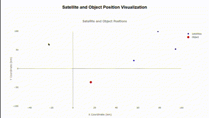

# Розробка додатку для візуалізації вимірювань GPS
## Завдання 
### Розробити додаток для відображення положення об'єкта та супутників:
+ Розробити веб-додаток, який підключається до WebSocket сервера та зчитує дані про положення супутників і об'єкта.
+ Відобразити отримані дані на графіку в декартових координатах. Для цього можна використати бібліотеку Plotly або іншу бібліотеку для роботи з графіками.

### Обробка та візуалізація даних:
+ Обробити дані, отримані через WebSocket, і відобразити положення об'єкта та супутників на графіку.
+ Додати можливість зміни параметрів вимірювальної частини GPS за допомогою API запитів.

### Налаштування графіка:
+ Відобразити координати супутників та об'єкта у декартових координатах.
+ Використати різні кольори або стилі точок для відображення супутників та об'єкта.

### Результат 

 
  

